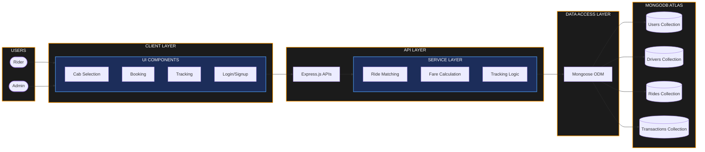

# TECHNICAL ARCHITECTURE

## Project Title

**UCAB – Cab Booking System (MERN Stack)**

## Objective

The technical architecture of the UCAB application defines how different layers of the system interact with each other to provide cab booking, ride tracking, authentication, payment processing, and ride management functionalities. The application follows a layered architecture using the MERN Stack (MongoDB, Express.js, React.js, and Node.js).

---

# 1. Client Layer (React.js)

The Client Layer is the frontend of the application where users interact with the system. It is developed using React.js and provides a responsive and user-friendly interface.

### Main Components

* **Login and Registration Page**: Handles user authentication, signup, login, and token storage.
* **User Dashboard**: Serves as the central hub for users to view profile, ongoing rides, and start new bookings.
* **Cab Booking Form**: Input interface for choosing pickup location, drop-off location, and requesting a ride.
* **Cab Selection Screen**: Visual display of available cab categories (e.g., Mini, Sedan, SUV) with dynamic fare estimates.
* **Ride Tracking Screen**: Interactive map displaying real-time driver movement and estimated time of arrival (ETA).
* **Booking History Page**: Lists previous rides with detailed status, fares, date, and invoice options.
* **Payment Interface**: Multi-channel payment screen supporting card, wallet, and net-banking options.
* **Admin Dashboard**: Analytics, driver registration approvals, active rides monitoring, and transaction logs.

### Responsibilities

* Collect user inputs and perform basic form validations.
* Render responsive user interfaces tailored for mobile, tablet, and desktop screens.
* Send HTTP requests to backend services via Axios/Fetch.
* Receive and display real-time ride updates (using Socket.io client).
* Provide a smooth and interactive user experience with transition animations and maps integration.

---

# 2. API Layer (Express.js)

The API Layer acts as the communication bridge between the frontend client and backend databases. It is developed using Express.js and exposes secure RESTful APIs.

### Sample APIs

#### User APIs

* `POST /api/users/register` - Create a new user account.
* `POST /api/users/login` - Authenticate user and return a JWT token.
* `GET /api/users/profile` - Fetch current user's profile information.

#### Ride APIs

* `POST /api/rides/book` - Initiate a booking request.
* `GET /api/rides/:id` - Fetch details of a specific ride.
* `PUT /api/rides/:id` - Update ride status (e.g., Accepted, In-Progress, Completed).
* `DELETE /api/rides/:id` - Cancel an active ride request.

#### Driver APIs

* `GET /api/drivers` - Fetch list of drivers based on status or location.
* `PUT /api/drivers/status` - Update driver availability and active coordinate details.

#### Payment APIs

* `POST /api/payments/create` - Initiate a payment checkout session.
* `GET /api/payments/history` - Fetch transaction logs for a user/driver.

### Responsibilities

* Handle and route HTTP requests.
* Validate incoming request payloads (schema, data types, headers).
* Implement middleware for authentication (JWT verification) and rate limiting.
* Route requests to appropriate Business Service Layer components.
* Standardize and return HTTP API responses and error codes.

---

# 3. Service Layer

The Service Layer contains the core business logic of the application. It decouples the API controllers from data access routines to maintain clean codebase modularity.

### Responsibilities

#### Fare Calculation
Calculates the dynamic fare for each ride based on:
* **Distance**: Base rate per kilometer.
* **Time**: Total estimated duration.
* **Vehicle Type**: Multiplier based on luxury/size (Mini, Sedan, SUV).
* **Dynamic Pricing**: Surge multipliers during high-demand hours or bad weather.

#### Driver Matching
* Scans coordinate metadata of available drivers.
* Computes geodesic distance to find drivers within a specified radius (e.g., 5km).
* Emits booking notifications to the nearest matching driver using Socket.io.

#### Ride Management
* Handles the creation, cancellation, and updates of rides.
* Coordinates changes in state: `PENDING` -> `ACCEPTED` -> `ARRIVED` -> `IN_TRANSIT` -> `COMPLETED`.
* Appends records to database logs for audit and booking history.

#### Real-Time Tracking
* Streams real-time geolocation coordinates from the driver app.
* Broadcasts progress logs to the matched rider client screen.
* Recalculates estimated time of arrival (ETA) dynamically.

#### Payment Processing
* Integrates with external payment gateways (e.g., Stripe/Razorpay) to process payments securely.
* Validates successful transactions and registers payment tokens.
* Triggers receipt generation and updates ride payment status.

---

# 4. Data Access Layer (Mongoose ODM)

The Data Access Layer manages all database interactions and executes queries using Mongoose ODM schemas.

### Collections & Schema Structures

#### Users Collection
Stores user credentials and profile details.
* `name` (String, Required)
* `email` (String, Required, Unique)
* `password` (String, Required)
* `phone` (String, Required)
* `role` (String, Default: 'rider')

#### Drivers Collection
Stores driver credentials, vehicle specs, and real-time status.
* `driverName` (String, Required)
* `vehicleType` (String, Required: Mini/Sedan/SUV)
* `licenseNumber` (String, Required)
* `availabilityStatus` (Boolean, Default: true)
* `currentCoordinates` (Object: { latitude, longitude })

#### Rides Collection
Tracks booking transactions, statuses, and locations.
* `riderId` (ObjectId referencing Users)
* `driverId` (ObjectId referencing Drivers)
* `pickupLocation` (String / GeoJSON)
* `dropLocation` (String / GeoJSON)
* `fare` (Number)
* `status` (String: Pending/Accepted/Arrived/In-Transit/Completed/Cancelled)

#### Payments Collection
Maintains financial records of ride completions.
* `rideId` (ObjectId referencing Rides)
* `amount` (Number)
* `paymentStatus` (String: Pending/Success/Failed)
* `transactionId` (String)

### Responsibilities

* Schema Definition & strict type validation.
* Database CRUD Operations (Create, Read, Update, Delete).
* Middleware hooks (e.g., pre-save password hashing).
* Performance optimization through database indexing (e.g., geospatial indexes for location searches).

---

# 5. Database Layer (MongoDB)

MongoDB acts as the persistent NoSQL database, optimized for handling highly transactional data structure write-loads (like ride-tracking logs and real-time locations).

### Key Features
* **NoSQL Document Store**: Flexible schema allow modifications without downtime.
* **Geospatial Queries**: Built-in support for coordinates search to match drivers (`$nearSphere` or `$geoWithin`).
* **High Scalability**: Sharding and replication support to ensure zero service interruption.
* **Fast Read/Write Performance**: Document nesting reduces query joins.

---

# Technical Architecture Diagram

The system architecture flow is illustrated below, mapping interactions from the client interface down to the MongoDB database collections:

### System Architecture Flow (Mermaid)



### Visual Architecture Diagram (Eraser System Diagram)

Here is the corresponding design architecture diagram:


---

# Data Flow Example (Booking a Ride)

```mermaid
sequenceDiagram
    autonumber
    actor User as React Client (Rider)
    participant API as Express API (/api/rides/book)
    participant Service as Service Layer (Fare & Match)
    database DB as MongoDB (Mongoose ODM)
    actor Driver as React Client (Driver)

    User->>API: POST /api/rides/book (Pickup & Drop-off details)
    activate API
    API->>API: Validate user details and inputs
    API->>Service: Trigger Fare Calculation & Driver Search
    activate Service
    Service->>Service: Compute Distance, Fare & Find Nearest Drivers
    Service-->>API: Return matched driver and fare
    deactivate Service
    API->>DB: Save Ride Booking (Status: PENDING)
    activate DB
    DB-->>API: Acknowledge Save
    deactivate DB
    API->>Driver: Dispatch ride request notification (Socket.io)
    API-->>User: Return booking confirmation and ETA
    deactivate API
```

### Step 1
User enters pickup and drop locations on the React frontend.

### Step 2
Frontend sends a POST request to: `POST /api/rides/book` with payload coordinates and passenger parameters.

### Step 3
Express API receives the request, parses the authorization header (JWT token), and validates input boundaries.

### Step 4
Service Layer executes calculations to determine the fare and calls location methods to identify available drivers within proximity.

### Step 5
The ride information is recorded in the MongoDB database via the Mongoose model (Status set to `PENDING`).

### Step 6
Driver receives a ride request notification on their screen via WebSockets/Socket.io.

### Step 7
User receives booking confirmation, matching driver details, and begins receiving real-time tracking feeds.

---

# Expected Outcome

After implementing the technical architecture:

* **Efficient Cab Booking**: Fast responses to bookings with dynamic real-time driver allocation.
* **Driver Management**: Drivers can toggle availability status and accept/reject rides instantly.
* **Admin Monitoring**: Interactive tracking dashboard for operational management.
* **Real-time Tracking**: Seamless location streaming using WebSockets.
* **Secure Operations**: JSON Web Token (JWT) authorization combined with SSL-protected payment gateways.
* **Scalable Data Store**: Fast, location-aware queries utilizing MongoDB geospatial indexation.

## Conclusion

The UCAB Cab Booking System follows a layered MERN architecture consisting of React.js, Express.js, Node.js, Mongoose, and MongoDB. This architecture ensures scalability, maintainability, security, and efficient communication between all components of the application.
