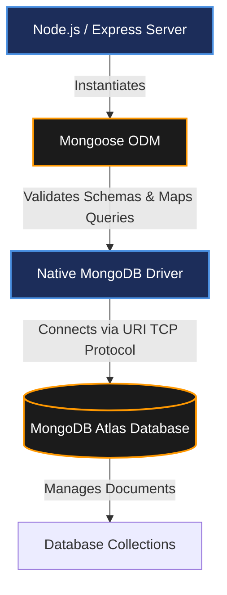

# CONFIGURE MONGODB

## Project Name

**UCAB – Cab Booking System**

## Technology Stack

MongoDB, Mongoose, Node.js

---

# Objective

The objective of this task is to configure the MongoDB database connection in the UCAB backend application using the Mongoose ODM library. MongoDB serves as the NoSQL persistence store for riders, drivers, bookings, and billing documents, while Mongoose provides schema validation and simplified CRUD capabilities.

---

# Introduction to MongoDB

MongoDB is a document-oriented NoSQL database that records data in JSON-like BSON documents. Its flexible schema-less structures make it highly scalable and optimized for fast read/write transactions (such as real-time vehicle coordinates updates).

### Core Features of MongoDB:
* **Document-Oriented Model**: Maps naturally to JSON-like javascript object paradigms.
* **Geospatial Indexes**: Offers native operators (`$nearSphere`, `$geoWithin`) to match available drivers.
* **Replication & Sharding**: Guarantees zero downtime and high horizontal scalability.

---

# Introduction to Mongoose

Mongoose is an Object Data Modeling (ODM) library specifically built for MongoDB and Node.js.

### Benefits of Mongoose:
* **Schema Enforcement**: Inserts strict type validation rules for NoSQL databases.
* **Middleware Hook Interceptors**: Integrates hooks (e.g. pre-save password encrypts).
* **Population Queries**: Binds references easily between collections (e.g. mapping a Ride to a Driver card).

---

# Installation of Mongoose

Install the package within the `Server` directory:
```bash
npm install mongoose
```

This updates your `package.json` manifest dependencies list.

---

# Database Configuration

### Step 1: Create Database Folder
Inside the backend `Server` folder, create a directory for configuration assets:
```text
db
```

### Step 2: Create Configuration File
Create a connection script:
```text
config.js
```

#### Database Connection Code (`db/config.js`):
```javascript
const mongoose = require("mongoose");

const connectDB = async () => {
  try {
    // Read connection URI from environment variables (fallback to local connection)
    const dbURI = process.env.MONGO_URI || "mongodb://127.0.0.1:27017/ucab";
    
    await mongoose.connect(dbURI);
    console.log("MongoDB Connected Successfully");
  } catch (error) {
    console.error("Database connection failed:", error.message);
    process.exit(1); // Shutdown application on database initialization failure
  }
};

module.exports = connectDB;
```

---

# Folder Structure

Following configuration setup, your backend directory matches as follows:

```text
Server/
│
├── db/
│   └── config.js       # Database connection pool script
│
├── models/             # Schema definitions
├── controllers/        # Logical controllers
├── routes/             # Endpoints routers
├── server.js           # Express main initialization script
└── package.json
```

---

# MongoDB Working Architecture

Below is the database communication pipeline:



---

# Connection Workflow

1. **Package Install**: Run `npm install mongoose` command.
2. **Config File Setup**: Create the `db/config.js` connection file.
3. **App Integration**: Import and call `connectDB()` inside `server.js`.
4. **Verifications**: Verify output console messages.
5. **Collection Operations**: Build Mongoose schemas to write data.

---

# Expected Output

Upon successful backend server initialization:

```text
Server Running on Port 5000
MongoDB Connected Successfully
```

---

# Strategic Advantages

* **Pool Management**: Automatically manages server connection sockets.
* **Clean Data Mappings**: Converts raw MongoDB records into usable JavaScript object graphs.
* **Failover Safety**: Automatically catch routing connection errors and retries pings.
