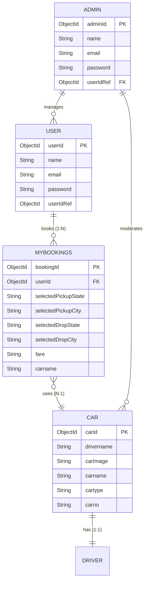

# CREATE SCHEMA AND MODELS

## Project Name

**UCAB – Cab Booking System**

## Technology Stack

MongoDB, Mongoose, Node.js (MERN Stack)

---

# Objective

The objective of this task is to configure the core database schemas and models utilizing the Mongoose ODM library. Mongoose Schemas define the strict data structures and validation constraints of documents stored in MongoDB collections, while Models provide the programmatic CRUD interface for request controllers.

---

# What is a Schema?

A Schema maps directly to a MongoDB collection and defines the shape of the documents within that collection.
It specifies:
* **Field Names**: Attributes for each entity.
* **Data Types**: Enforced types (String, Number, Date, Boolean, Array, ObjectId).
* **Reference Relationships**: Binds primary keys of collections to build logical relations (`ref` mapping).
* **Validation Rules**: Required fields, unique flags, default values, and range check constraints.

---

# 1. Admin Schema

The Admin Schema stores details of platform system administrators.

### Fields Configuration

| Field | Type | Description |
| :--- | :---: | :--- |
| `name` | String | Administrator's Full Name |
| `email` | String | Login Email address (Unique) |
| `password` | String | Secured hashed password |
| `userId` | ObjectId | Reference link pointing to the main User entry |

#### Code Definition (`models/AdminSchema.js`):
```javascript
const mongoose = require('mongoose');

const AdminSchema = new mongoose.Schema({
    name: {
        type: String,
        required: true
    },
    email: {
        type: String,
        required: true,
        unique: true
    },
    password: {
        type: String,
        required: true
    },
    userId: {
        type: mongoose.Schema.Types.ObjectId,
        ref: "User"
    }
});

const Admin = mongoose.model("Admin", AdminSchema);
module.exports = Admin;
```

---

# 2. User Schema

The User Schema stores general application user (rider) credentials and settings.

### Fields Configuration

| Field | Type | Description |
| :--- | :---: | :--- |
| `name` | String | User's Full Name |
| `email` | String | Unique email used for auth pings |
| `password` | String | Encrypted password string |
| `userId` | ObjectId | User reference ID |

#### Code Definition (`models/UserSchema.js`):
```javascript
const mongoose = require('mongoose');

const UserSchema = new mongoose.Schema({
    name: {
        type: String,
        required: true
    },
    email: {
        type: String,
        required: true,
        unique: true
    },
    password: {
        type: String,
        required: true
    },
    userId: {
        type: mongoose.Schema.Types.ObjectId,
        ref: "User"
    }
});

const User = mongoose.model("User", UserSchema);
module.exports = User;
```

---

# 3. Car Schema

The Car Schema stores vehicle records and driver links.

### Fields Configuration

| Field | Type | Description |
| :--- | :---: | :--- |
| `drivername` | String | Matched driver name |
| `carImage` | String | URL reference path to stored vehicle images |
| `carname` | String | Car vehicle model name |
| `cartype` | String | Category class (Mini / Sedan / SUV) |
| `price` | String | Fare price multiplier values |
| `carno` | String | Unique vehicle license plate identifier |

#### Code Definition (`models/CarSchema.js`):
```javascript
const mongoose = require('mongoose');

const carSchema = new mongoose.Schema({
    drivername: {
        type: String,
        required: true
    },
    carImage: {
        type: String,
        required: true
    },
    carname: {
        type: String,
        required: true
    },
    cartype: {
        type: String,
        required: true,
        enum: ["Mini", "Sedan", "SUV", "Premium"]
    },
    price: {
        type: String,
        required: true
    },
    carno: {
        type: String,
        required: true,
        unique: true
    }
});

const Car = mongoose.model("Car", carSchema);
module.exports = Car;
```

---

# 4. MyBooking Schema

The MyBooking Schema logs transaction booking states, routes, and coordinate details.

### Fields Configuration

| Field | Type | Description |
| :--- | :---: | :--- |
| `selectedPickupState`| String | State code for pickup location |
| `selectedPickupCity` | String | City location for pickup |
| `selectedDropState`  | String | State code for drop destination |
| `selectedDropCity`   | String | City location for drop destination |
| `pickupdate`         | String | Configured pickup date |
| `pickuptime`         | String | Configured pickup time |
| `dropdate`           | String | Configured drop date |
| `droptime`           | String | Configured drop time |
| `drivername`         | String | Matched driver name |
| `fare`               | String | Dynamic calculated trip fare |
| `carname`            | String | Allocated vehicle model |
| `cartype`            | String | Vehicle category tier |
| `carno`              | String | Vehicle registration number |
| `price`              | String | Multiplier price base |
| `userId`             | ObjectId | Reference key targeting passenger's User ID |
| `userName`           | String | Name value copy of the user |
| `bookeddate`         | String | Date when booking transaction was processed |

#### Code Definition (`models/MyBookingSchema.js`):
```javascript
const mongoose = require('mongoose');

const rideSchema = new mongoose.Schema({
    selectedPickupState: String,
    selectedPickupCity: String,
    selectedDropState: String,
    selectedDropCity: String,
    pickupdate: String,
    pickuptime: String,
    dropdate: String,
    droptime: String,
    drivername: String,
    fare: String,
    carname: String,
    cartype: String,
    carno: String,
    price: String,
    userId: {
        type: mongoose.Schema.Types.ObjectId,
        ref: "User"
    },
    userName: String,
    bookeddate: {
        type: String,
        default: () => new Date().toLocaleDateString("en-IN")
    }
});

const Mybookings = mongoose.model("Mybookings", rideSchema);
module.exports = Mybookings;
```

---

# Database Schema Relationships

The diagram below details the structural associations across MongoDB collections:



---

# Strategic Advantages of Models

* **Data Structure Constraints**: Prevents document formats corruption by enforcing Mongoose schema types.
* **Declarative CRUD Operations**: Provides simplified helper queries (`find()`, `create()`, `findByIdAndUpdate()`) abstracting raw NoSQL syntax.
* **Audit Trails**: Default parameters and middleware triggers simplify transaction audits.

---

# Expected Outcome

Successfully created MongoDB schemas and models for Admin, User, Car, and Booking collections. These models provide a structured database design for the UCAB Cab Booking System and support all ride booking operations.
