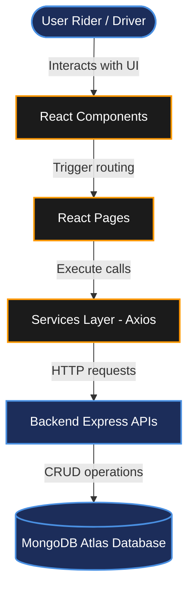

# FRONTEND STRUCTURE

## Project Name

**UCAB – Cab Booking System**

## Technology Stack

React.js, JavaScript, Bootstrap CSS, Axios, React Router DOM (MERN Stack)

---

# Objective

The frontend structure of the UCAB application outlines the directory configurations of our React.js web client. Following a component-based directory architecture separates reusable elements (`components`), container layout engines (`pages`), styling assets (`assets`), and endpoint fetchers (`services`), keeping code files modular and easy to scale.

---

# Technology Stack

* **React.js**: Component-based UI library.
* **JavaScript (ES6+)**: Frontend language standard.
* **Bootstrap**: Layout styling grid and component template modules.
* **Axios**: Promised-based network query client for Express.js API integrations.
* **React Router DOM**: Declarative frontend navigation engine.

---

# Frontend Folder Structure

Below is the directory tree mapping for the React client `Client` container:

```text
Client/
│
├── public/                 # Static asset folders (logos, page favicons)
│
├── src/                    # Main development source directory
│   ├── assets/             # CSS styling, backgrounds, and static UI resources
│   ├── components/         # Reusable presentation component blocks
│   │   ├── Navbar.jsx      # Top app navigation header
│   │   ├── Footer.jsx      # Bottom footer links panel
│   │   ├── CabCard.jsx     # Vehicle item representation widget
│   │   └── BookingForm.jsx # Geolocation pickup/drop inputs module
│   │
│   ├── pages/              # Master layout view pages
│   │   ├── Home.jsx        # Landing promotional splash views
│   │   ├── Login.jsx       # Credentials login screens
│   │   ├── Signup.jsx      # Onboarding account registration
│   │   ├── Booking.jsx     # Active cab matching maps view
│   │   ├── RideHistory.jsx # Previous completed rides details
│   │   └── Profile.jsx     # User settings profile card
│   │
│   ├── services/           # Network communications controllers
│   │   ├── userService.js  # Auth calls and user profiles updates
│   │   ├── bookingService.js# Booking request commands
│   │   └── paymentService.js# Checkout transactions pings
│   │
│   ├── App.jsx             # Main layout, routing, and provider wrapper
│   ├── main.jsx            # React runtime DOM mount entry-point
│   └── index.css           # Global override stylesheets
│
├── package.json            # Client library dependencies manifest
├── vite.config.js          # Vite build pipeline adjustments
└── index.html              # Main HTML mounting container
```

---

# Folder Explanations

### `public/`
Houses media files and resources loaded outside compiled files.
* *Examples*: App logos, standard SVG assets, site favicons.

### `src/assets/`
Contains styling assets compiled by the bundler.
* *Examples*: Custom CSS stylesheet classes, background images, static graphics.

### Components Folder (`src/components/`)
Stores reusable UI widgets. Breaking the UI into atomic components (e.g. `CabCard` or `BookingForm`) ensures we write clean, DRY (Don't Repeat Yourself) code.

### Pages Folder (`src/pages/`)
Stores view files bound directly to routing URLs.
* *Examples*: `/login` renders `Login.jsx`, `/booking` renders `Booking.jsx`.

### Services Folder (`src/services/`)
Decouples React components from direct network fetch calls. All endpoint pings are mapped inside Axios wrappers (e.g., `userService.js`), facilitating quick API modifications.

---

# Frontend Interaction Pipeline

The diagram below details the communication architecture from client clicks down to database collections:



---

# Strategic Advantages of the Layout

* **Component Reusability**: Modular components reduce duplicate JSX structures across view files.
* **Axios Centralization**: Network configurations (base URLs, JWT authorization headers) are mapped inside a single configuration service.
* **Simplified Route Mapping**: Clean root paths declarations using `React Router DOM` nested within `App.jsx`.

---

# Expected Outcome

Successfully designed the frontend structure of the UCAB Cab Booking System using React.js. The structure supports modular development, API integration, and responsive user interfaces for cab booking operations.
