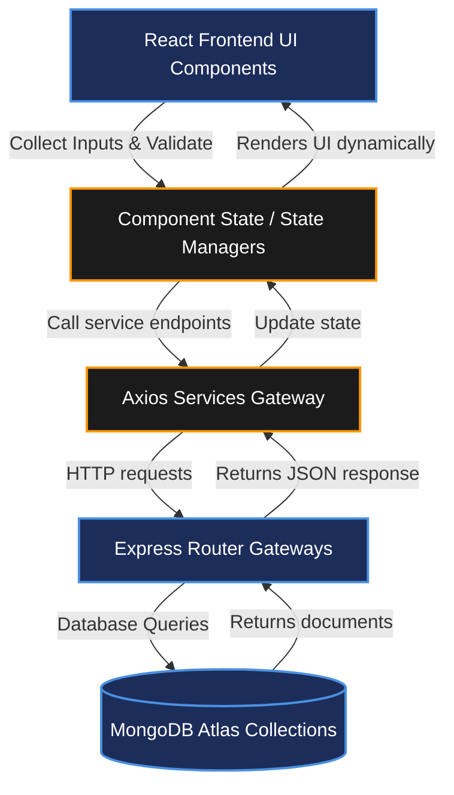

# FRONTEND DEVELOPMENT AND EXPLANATION

## Project Name

**UCAB – Cab Booking System**

## Technology Stack

React.js, Axios, Bootstrap, JavaScript (MERN Stack)

---

# Objective

The Frontend Development and Explanation module details the user-side and admin-side React components built into the UCAB client app. Defining features and parameters for landing portals, registration forms, dashboards, and management grids provides a detailed specification to help the UI team develop layouts and integrate API states.

---

# User-Side UI Components

## 1. Public Portals & Onboarding
* ### `Home.jsx`
  The public promotional landing gateway page.
  * *Features*: Brand introduction, service features summaries, navigation bars, and CTA access buttons routing users to registration and login forms.
* ### `Login.jsx`
  Provides secure rider identity authentication.
  * *Features*: Form validation (checks formatting constraints), calls Axios auth service endpoints, returns JWT tokens to secure local storage, and routes users to the dashboard.
* ### `Register.jsx`
  Allows new riders to join the platform.
  * *Features*: Account creation forms, password verification fields, and profiles registration inside MongoDB.

## 2. Rider Workspace
* ### `Uhome.jsx` (User Dashboard)
  The central operational hub rendered post-login.
  * *Features*: Custom greeting cards, summaries of ongoing trip statuses, and quick navigations to available cabs or transaction logs.
* ### `Cabs.jsx`
  Displays active cab availability rosters fetched from the backend.
  * *Features*: Multi-tier comparisons, dynamic fare indicators, and action booking buttons.
* ### `BookCab.jsx`
  Permits riders to schedule and finalize a booking choice.
  * *Features*: Captures `carId` from router parameter coordinates, gathers pickup/drop states, time parameters, and commits bookings requests.
* ### `MyBookings.jsx`
  Exposes active and archived trip logs.
  * *Features*: Details driver cards, maps pickup times, tracks status changes, and loads invoice downloads.
* ### `Unav.jsx`
  Rider navigation utility bar.
  * *Features*: Navigation routing links (Home, Cabs, My Bookings) and logout actions.

---

# Admin-Side UI Components

## 1. Admin Onboarding
* ### `ALogin.jsx`
  Authenticates administrator access credentials.
  * *Features*: Portal interface for administrators returning JWT admin session credentials.
* ### `ARegister.jsx`
  Allows creation of administrative accounts.

## 2. Admin Workspace
* ### `AHome.jsx` (Admin Dashboard)
  The analytical dashboard for operations overview.
  * *Features*: Aggregated stats widgets (Total active users, active bookings, online drivers), and control routing hooks.
* ### `ANav.jsx`
  Admin navigation utility bar.
  * *Features*: Access panels routes (Users, Bookings, Cabs, Add Car) and logout actions.

## 3. Account & Content Management
* ### `Users.jsx`
  Exposes registrations registries.
  * *Features*: Interactive datatables detailing rider metadata, delete actions, and update buttons.
* ### `UserEdit.jsx`
  Edits registration variables.
  * *Features*: Reads user parameters by ID, provides edit fields, and commits updates.
* ### `Bookings.jsx`
  Platform-wide booking supervisor grid.
  * *Features*: Lists all bookings, enables manual overrides, and manages updates.
* ### `ACabs.jsx`
  Exposes the vehicle fleet register.
  * *Features*: Renders car card details, edit triggers, and deletion tools.
* ### `ACabEdit.jsx`
  Modifies vehicle profile assets.
  * *Features*: Updates vehicle names, capacities, categories, and rate multipliers.
* ### `AddCar.jsx`
  Registers new cars into the database.
  * *Features*: Multi-part form-data inputs (enabling Multer upload pings for vehicle profile photos).

---

# Frontend Operations Workflow

Below is the dynamic rendering pipeline detailing how UI components communicate with backend databases:

---

# Expected Outcome

Successfully developed the frontend architecture of the UCAB Cab Booking System using React.js. The application provides separate modules for users and administrators, ensuring smooth cab booking, ride management, and administrative control.
