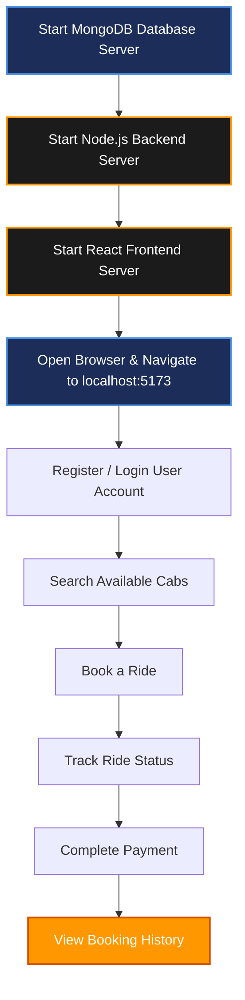

# STEPS FOR EXECUTION

## Project Name

**UCAB – Cab Booking System**

---

# Objective

This document explains the steps required to execute and run the UCAB Cab Booking System successfully on a local development machine using the MERN Stack (MongoDB, Express.js, React.js, and Node.js).

---

# Step 1: Set Up the Frontend (React Application)

Open Visual Studio Code and launch a terminal.

1. Navigate to the client folder:
   ```bash
   cd client
   ```
2. Install all required dependencies:
   ```bash
   npm install
   ```
3. Start the React development server:
   ```bash
   npm run dev
   ```
The frontend application will run on:
```text
http://localhost:5173
```

---

# Step 2: Set Up the Backend (Express Server)

Open a new terminal window inside Visual Studio Code.

1. Navigate to the server folder:
   ```bash
   cd server
   ```
2. Install backend dependencies:
   ```bash
   npm install
   ```

---

# Step 3: Configure Environment Variables

Inside the `server` folder, create a configuration file named:
```text
.env
```

Add the following environment configuration parameters:
```env
MONGO_URI=mongodb://localhost:27017/UCAB
PORT=8000
JWT_SECRET=mysecretkey
```

*Note: Change `mysecretkey` in production environments.*

---

# Step 4: Start MongoDB Database

Ensure MongoDB is installed and running on your local machine.

* **Windows**: Open Command Prompt as Administrator and start the MongoDB service:
  ```cmd
  net start MongoDB
  ```
* **macOS**: Start using brew services:
  ```bash
  brew services start mongodb-community
  ```
* **Linux**: Start MongoDB daemon:
  ```bash
  sudo systemctl start mongod
  ```

Verify that MongoDB is active and accepting connections before booting up the backend server.

---

# Step 5: Start the Backend Server

Execute the backend server using one of the following commands:
```bash
nodemon index.js
```
or
```bash
node index.js
```

The backend server will run and accept HTTP requests on:
```text
http://localhost:8000
```

---

# Application Execution Workflow

Below is the installation and runtime sequence pipeline:



---

# Expected Output Parameters

* **Frontend Server URL**: `http://localhost:5173` (React View Layer)
* **Backend API Server URL**: `http://localhost:8000` (Express controllers)
* **Database Instance**: MongoDB Local Server (`mongodb://localhost:27017/UCAB`)

---

# Technologies Used

* **React.js**: Front-end interactive layouts.
* **Node.js**: Backend JavaScript runtime.
* **Express.js**: Backend API routing and controllers framework.
* **MongoDB**: NoSQL database for document storage.
* **Mongoose**: Mappings schema validation library.
* **Axios**: Network endpoints communication wrapper.
* **JWT**: Stateless token authorizations.
* **Bootstrap**: Layout styling components.

---

# Conclusion

The UCAB Cab Booking System can be executed successfully by configuring MongoDB, starting the backend server, and launching the React frontend application. This setup enables users to register, book rides, manage bookings, and access real-time cab booking services through a responsive web interface.
