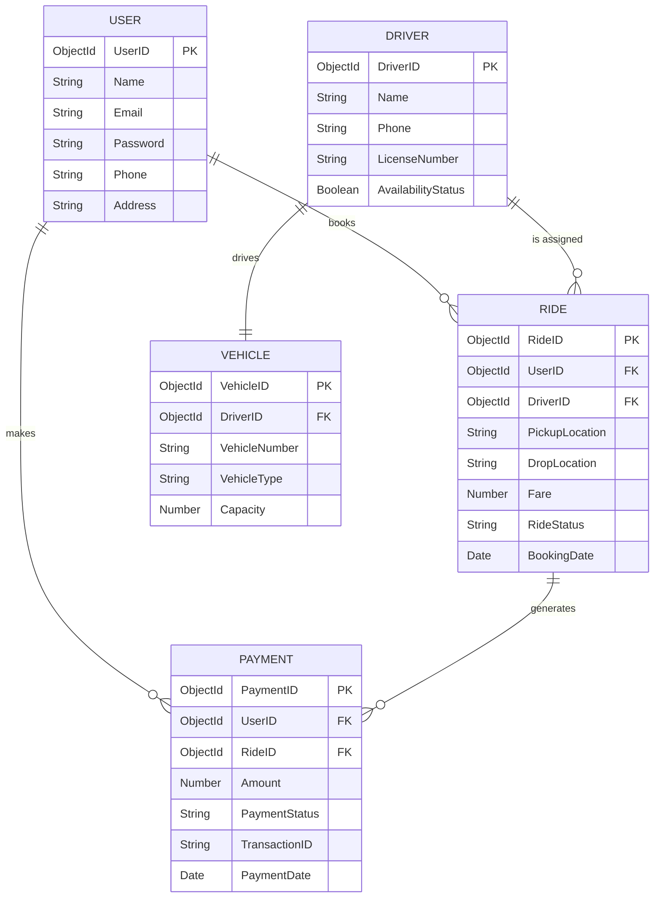

# ER - DIAGRAM

## Project Title

**UCAB – Cab Booking System (MERN Stack)**

## Objective

The Entity Relationship (ER) Diagram represents the structure of the database and the relationships between different entities in the UCAB Cab Booking System. It helps in understanding how data is stored and connected within the application.

---

# Main Entities & Attributes

## 1. User
The User entity stores information about customers who use the application to book rides.
* `UserID` (Primary Key, ObjectId)
* `Name` (String)
* `Email` (String, Unique)
* `Password` (String)
* `Phone` (String)
* `Address` (String)

## 2. Ride
The Ride entity stores details of cab bookings made by users.
* `RideID` (Primary Key, ObjectId)
* `UserID` (Foreign Key referencing User)
* `DriverID` (Foreign Key referencing Driver)
* `PickupLocation` (String)
* `DropLocation` (String)
* `Fare` (Number)
* `RideStatus` (String: Pending/Accepted/Arrived/In-Transit/Completed/Cancelled)
* `BookingDate` (Date)

## 3. Driver
The Driver entity stores information about cab drivers.
* `DriverID` (Primary Key, ObjectId)
* `Name` (String)
* `Phone` (String)
* `LicenseNumber` (String, Unique)
* `AvailabilityStatus` (Boolean)

## 4. Vehicle
The Vehicle entity stores information related to vehicles assigned to drivers.
* `VehicleID` (Primary Key, ObjectId)
* `DriverID` (Foreign Key referencing Driver, Unique)
* `VehicleNumber` (String, Unique)
* `VehicleType` (String: Mini/Sedan/SUV)
* `Capacity` (Number)

## 5. Payment
The Payment entity stores details of transaction receipts for ride bookings.
* `PaymentID` (Primary Key, ObjectId)
* `UserID` (Foreign Key referencing User)
* `RideID` (Foreign Key referencing Ride)
* `Amount` (Number)
* `PaymentStatus` (String: Pending/Success/Failed)
* `TransactionID` (String, Unique)
* `PaymentDate` (Date)

---

# Relationship Explanation

## User – Ride Relationship
* **Type**: One-to-Many (1:M)
* **Meaning**: One user can book multiple rides over time, but each individual ride belongs to exactly one user.
* **Implementation**: The `Rides` collection contains `UserID` as a Foreign Key reference.

## Ride – Driver Relationship
* **Type**: Many-to-One (M:1) / One-to-Many (1:M) from Driver perspective
* **Meaning**: A driver can be assigned to multiple rides over their shift history, but each ride is assigned to only one driver.
* **Implementation**: The `Rides` collection contains `DriverID` as a Foreign Key reference.

## Driver – Vehicle Relationship
* **Type**: One-to-One (1:1)
* **Meaning**: Each driver is assigned to exactly one vehicle, and each vehicle is driven by one active driver.
* **Implementation**: The `Vehicles` collection contains `DriverID` as a unique Foreign Key reference.

## User – Payment Relationship
* **Type**: One-to-Many (1:M)
* **Meaning**: One user can make multiple payments for different bookings, but each payment is linked to a single user.
* **Implementation**: The `Payments` collection contains `UserID` as a Foreign Key reference.

---

# Entity Relationship Diagrams

### Interactive Logical Schema (Mermaid)

### Conceptual ER Diagram (Chen Notation Visual)

Below is the conceptual representation mapping the relationships (books, assigned, drives, makes) between entities:

---

# Database Flow

1. **User Auth**: A user registers and logs in, creating a record in the `Users` collection.
2. **Ride Creation**: The user requests a cab, creating a new record in the `Rides` collection with status set to `Pending`.
3. **Driver Allocation**: The matching service searches for nearby `Drivers` who are marked `true` for `AvailabilityStatus`.
4. **Driver Assigned**: A driver is matched. Their `DriverID` is added to the `Ride` record, and status changes to `Accepted`.
5. **Vehicle Association**: The system links the ride details to the driver's vehicle specs via the 1:1 `Driver-Vehicle` relationship.
6. **Payment Processing**: Upon ride completion, a transaction record is created in the `Payments` collection linked to the corresponding `UserID` and `RideID`.

---

# Benefits of the ER Design

* **Zero Redundant Data**: Clean separation of vehicle, driver, and user entities prevents double storage.
* **Geospatial Readiness**: The coordinate logs are structured to support fast indexing queries.
* **Referential Integrity**: Mongoose references safeguard database actions (preventing orphaned rides or payments).
* **High Extensibility**: Simple to append ratings, ride logs, or promo coupons in the future.

---

# Conclusion

The ER Diagram of the UCAB Cab Booking System defines the relationship between Users, Rides, Drivers, Vehicles, and Payments. The design ensures efficient ride management, driver assignment, and vehicle tracking while maintaining database consistency and scalability.
