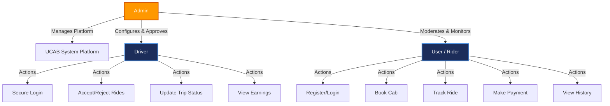

# ROLES AND RESPONSIBILITIES

## Project Title

**UCAB – Cab Booking System (MERN Stack)**

## Objective

The Roles and Responsibilities module defines the permissions and functionalities available to different users of the UCAB system. The application follows a Role-Based Access Control (RBAC) approach where Users, Drivers, and Admins have specific responsibilities and access rights.

---

# Introduction

The UCAB Cab Booking System consists of three primary roles:
1. **User (Rider)**
2. **Driver**
3. **Admin**

Each role performs specific tasks to ensure smooth operation of the cab booking platform.

---

# 1. User (Rider)

The User is the customer who uses the application to book cab rides and manage travel activities.

## Responsibilities

### Registration and Login
* Create a new account.
* Login using email and password.
* Manage personal profile information.

### Cab Booking
* Select pickup location.
* Select destination.
* Choose cab type (Mini, Sedan, SUV, Premium).
* Confirm ride booking.

### Ride Tracking
* Track assigned driver in real-time.
* View ride progress from pickup to destination.

### Payment Management
* Make online payments.
* View payment receipts.
* Access transaction history.

### Ride History
* View completed rides.
* Check previous booking details.
* Download ride receipts.

---

# 2. Driver

The Driver is responsible for accepting ride requests and providing transportation services.

## Responsibilities

### Driver Login
* Login securely into the system.
* Access assigned rides.

### Ride Management
* View incoming ride requests.
* Accept or reject ride requests.
* Navigate to pickup location.

### Ride Status Updates
* Update ride status sequentially:
  * `Accepted` (Driver accepts the booking)
  * `Started` (Driver reaches pickup and starts the ride)
  * `In Progress` (Trip underway)
  * `Completed` (Destination reached)

### Earnings Management
* View daily earnings.
* Check completed rides.
* Monitor ride statistics.

### Ride History
* Access previous ride records.
* View completed trip details.

---

# 3. Admin

The Admin manages the overall operation of the UCAB platform.

## Responsibilities

### User Management
* View registered users.
* Update user information.
* Block or remove users when required.

### Driver Management
* Add new drivers.
* Verify driver credentials (license, background checks).
* Manage driver accounts.

### Booking Management
* Monitor all active and historical ride bookings.
* Track ride status in real-time.
* Resolve booking issues or disputes.

### Payment Monitoring
* Monitor payment transactions.
* Verify payment status.
* Generate payment reports.

### Reports and Analytics
* View system performance reports.
* Analyze booking trends (peak hours, demand areas).
* Monitor overall platform health and usage.

### Vehicle Category Management
* Add new vehicle categories.
* Update cab specifications and base pricing rates.
* Remove unused categories.
  * *Examples*: Mini Cab, Sedan, SUV, Premium Cab.

---

# Role Relationship Diagram

### System Roles Diagram (Mermaid)

---

# Role-Based Access Control (RBAC) Matrix

| Function | User | Driver | Admin |
| :--- | :---: | :---: | :---: |
| Register/Login | **Yes** | **Yes** | **Yes** |
| Book Cab | **Yes** | No | No |
| Track Ride | **Yes** | **Yes** | **Yes** |
| Accept Ride | No | **Yes** | No |
| Update Ride Status | No | **Yes** | No |
| View Earnings | No | **Yes** | **Yes** |
| Manage Users | No | No | **Yes** |
| Manage Drivers | No | No | **Yes** |
| View Reports | No | No | **Yes** |
| Manage Vehicle Categories | No | No | **Yes** |

---

# Development Team Roles & Responsibilities

For project execution, the 5-member team is structured as follows:

| Team Member | Role | Key Responsibilities |
| :--- | :--- | :--- |
| **Member 1** | **Project Manager / Architect** | Handles Epic 1 (Architecture), oversees task management (Kanban), writes documentation, and ensures team integration. |
| **Member 2** | **Frontend Lead** | Sets up the React/Vite project structure, configures state management (e.g., Redux/Context API), and defines global CSS/UI standards. |
| **Member 3** | **Frontend Developer** | Builds specific UI pages (Login, Dashboard, Cab Selection) and connects them to the backend APIs using Axios/Fetch. |
| **Member 4** | **Backend Lead** | Sets up the Node.js/Express server, defines the API architecture, and writes core business logic (e.g., fare calculation, driver matching). |
| **Member 5** | **Database & Backend Dev** | Configures MongoDB Atlas, creates Mongoose schemas (ER Diagram implementation), and builds CRUD APIs for rides and users. |

---

# Benefits of Role-Based System

* **Improved Security**: Restricts critical backend APIs based on token permissions.
* **Controlled Access**: Prevents drivers from accessing user settings, and vice-versa.
* **Better User Management**: Simplified flow for admin oversight.
* **Easy Maintenance**: Decoupled roles mean logic changes for one role do not break features of another.
* **Scalable Architecture**: Easy to introduce new user tiers (e.g., Corporate User or Dispatcher) in the future.

---

# Conclusion

The UCAB Cab Booking System uses three major roles: User, Driver, and Admin. Each role is assigned specific responsibilities to ensure secure access, smooth ride management, efficient booking operations, and effective system administration. This role-based structure improves security, maintainability, and overall application performance.
