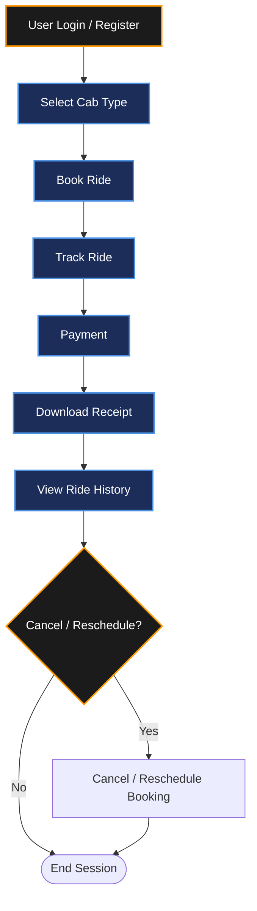

# FEATURES DOCUMENTATION

## Project Name

**UCAB – Cab Booking System**

## Technology Stack

MERN Stack (MongoDB, Express.js, React.js, Node.js)

---

# Objective

The UCAB Features Module outlines the core functional requirements and core capabilities built into the platform, ensuring safe user onboarding, flexibility in booking adjustments, automated financial calculations, and secure trip tracking.

---

# Core Features

## 1. User and Driver Authentication (Login/Signup)

The system provides secure authentication mechanisms for both riders and drivers to protect personal information and enforce role-based access.

### Rider (User) Authentication
* **User Registration**: Seamless account creation with name, email, phone number, and password.
* **User Login**: Secured access utilizing email and password validation.
* **Password Encryption**: Automated database-level hashing using the `bcryptjs` library prior to storage.
* **JWT Token Authorization**: State-less, secure authentication tokens generated on the server and verified by Axios interceptors in React.
* **Profile Management**: Profile fields modification, phone verification, and session logout controls.

### Driver Authentication
* **Driver Registration**: Driver account creation with vehicle configuration parameters.
* **Driver Login**: Access control for matched drivers.
* **Driver Verification**: Document review status (checking driver licenses and vehicle insurance).
* **Session Management**: Session tracking via secure local tokens.

### Benefits
* Safe client credential hashing to block database extraction threats.
* Access restriction to prevent riders from viewing driver logs (RBAC enforcement).
* Fast page reload authorization using client token validation.

---

## 2. Cab Type Selection

Riders can compare dynamic fare pricing across multiple vehicle categories depending on their travel preferences.

### Available Cab Tiers
* **Mini**: Budget-friendly compact cars for quick individual travel.
* **Sedan**: Mid-sized comfort cars suitable for standard groups (up to 4 passengers).
* **SUV**: Spacious large-cabin vehicles optimized for luggage and family commutes.
* **Premium Cab**: High-end luxury sedans for executive-class experiences.

### Benefits
* Multi-tier travel flexibility tailored to varying travel budgets.
* Immediate distance-fare estimates before booking confirmation.
* Enhanced user matching satisfaction rates.

---

## 3. Ride History and Receipt Download

The platform archives completed trips to maintain transactional transparency and easy expense tracking.

### Key Capabilities
* **Trip History List**: Overview of completed, in-transit, and canceled rides.
* **Metadata Logs**: Logs vehicle type, total trip duration, travel date, and timestamps.
* **Driver Details Card**: Review matched driver name, profile picture, contact details, and vehicle license plate.
* **Dynamic PDF Receipts**: Generation of travel invoice files containing total tax components and distance fares.
* **Download Receipts**: In-app download buttons for digital invoice receipts.

### Benefits
* Digital tax and expense logs for corporate travel logs.
* Direct proof of payment for passenger safety audits.
* Historical fare tracking and transparent billing records.

---

## 4. Scheduled Bookings

Riders can schedule cab bookings for future dates and times, ensuring ride availability during critical travel schedules.

### Workflow Details
* **Calendar Date Picker**: Select specific future dates.
* **Time Wheel Selector**: Configure desired pickup times.
* **Booking State Pin**: Mark bookings under state `SCHEDULED`.
* **Push Notifications**: Receive SMS/Email booking confirmations before the dispatch cycle begins.

### Benefits
* Guaranteed cab matching priority during peak hours.
* Better passenger commute planning (e.g. airport schedules).
* Automated queuing of dispatch orders inside the backend scheduler service.

---

## 5. Booking Cancellation and Rescheduling

Riders can cancel or modify booking parameters if travel plans change.

### Cancellation Module
* **Instant Cancellation**: Cancel active booking prior to driver arriving at pickup point.
* **Notification Logs**: Instantly alerts the matched driver of the cancellation.
* **Fare Refund Policy**: Computes cancellation fees based on proximity duration.

### Rescheduling Module
* **Time Modification**: Reschedule pickup hours without canceling the booking.
* **Destination Update**: Update destination coordinates dynamically mid-route.
* **Driver Reallocation**: Reassign alternative available drivers if timing slots change.

### Benefits
* High operational flexibility for riders.
* Driver protection from sudden routing waste.
* Clean operational state transitions.

---

# Feature Workflow

Below is the conceptual path a user follows during a standard UCAB lifecycle:

---

# Expected Outcome

The UCAB features implementation delivers a complete service architecture offering secure user logins, dynamic selection categories, flexible cancellation options, future booking queues, and digital expense auditing. This ensures a reliable, secure MERN Stack cab booking system.
