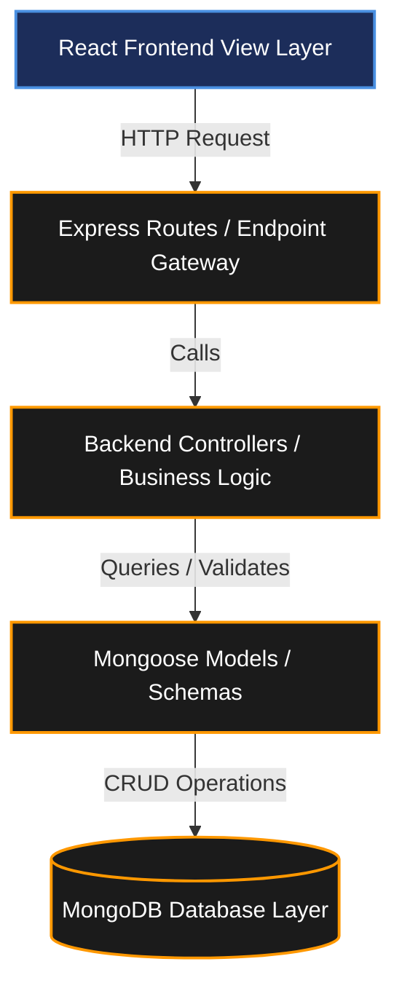

# MVC PATTERN DOCUMENTATION

## Project Name

**UCAB – Cab Booking System**


## Technology Stack

MongoDB, Express.js, React.js, Node.js (MERN Stack)

---

# Objective

The Model-View-Controller (MVC) architectural pattern defines the structural separation of concerns in the UCAB application. By decoupling data models, controller route handlers, and frontend components, this architecture ensures high codebase scalability, simplified unit testing, and concurrent team development.

---

# 1. Model Layer (Data Layer)

The Model layer handles all database-related structures, field validation rules, and operations.

### Responsibilities
* Define MongoDB collections schemas using Mongoose ODM.
* Execute CRUD (Create, Read, Update, Delete) database operations.
* Implement pre-save middlewares (e.g., password hashing via bcrypt).
* Maintain strict data types and check input formats before writing to MongoDB Atlas.

### Models Used in UCAB

#### User Model
Stores client credentials and account attributes:
* `name` (String, Required)
* `email` (String, Required, Unique)
* `password` (String, Required, Encrypted)
* `phone` (String, Required)
* `address` (String, Optional)

#### Driver Model
Tracks driver onboarding credentials and active status:
* `driverName` (String, Required)
* `licenseNumber` (String, Required, Unique)
* `availabilityStatus` (Boolean, Default: true)
* `vehicleId` (ObjectId referencing Vehicle Model)

#### Ride Model
Logs booking coordinate traces and status lifecycles:
* `userId` (ObjectId referencing User Model)
* `driverId` (ObjectId referencing Driver Model)
* `pickupLocation` (String, Required)
* `dropLocation` (String, Required)
* `fare` (Number, Required)
* `status` (String: Pending/Accepted/Arrived/In-Transit/Completed/Cancelled)

#### Payment Model
Stores transaction outcomes and invoice codes:
* `rideId` (ObjectId referencing Ride Model)
* `paymentMethod` (String: Card/Wallet/NetBanking)
* `amount` (Number, Required)
* `transactionId` (String, Unique)
* `paymentStatus` (String: Pending/Success/Failed)

---

# 2. Controller Layer

Controllers hold the core business logic of UCAB, acting as the intermediary between Mongoose models and Express router endpoints.

### Responsibilities
* Receive and parse incoming HTTP request payloads (`req.body`, `req.params`, `req.query`).
* Verify user permissions and token payloads.
* Execute core algorithms (such as ride-matching distance queries or dynamic fare calculations).
* Interact with Mongoose models to read or update states.
* Package clean JSON responses and HTTP status codes (`res.status().json()`).

### Core Controllers in UCAB

#### User Controller
* `registerUser`: Validates input, hashes password, saves new user.
* `loginUser`: Authenticates credentials, generates JWT auth token.
* `getUserProfile`: Fetches user profile card based on validated JWT token.

#### Driver Controller
* `registerDriver`: Saves driver credentials and uploads files.
* `acceptRide`: Assigns driver's ID to ride record and updates status.
* `completeRide`: Ends ride tracking, triggers payment request.

#### Ride Controller
* `bookRide`: Initiates search queries for nearby drivers and estimates fare.
* `cancelRide`: Cancels booking request if criteria are met.
* `trackRide`: Submits live GPS coordinate logs.

#### Payment Controller
* `processPayment`: Integrates with billing gateway, saves success state.
* `generateReceipt`: Generates dynamic billing metadata.

---

# 3. View Layer (Routing Layer)

In a decoupled headless API architecture like UCAB, the View layer is split:
* **Backend View**: Represented by **Express API Routes** that act as the interface exposing backend controllers to the network.
* **Frontend View**: Represented by **React UI Components** that fetch data from routes and render interfaces to the client.

### Responsibilities
* Map incoming HTTP request paths (URLs) to controller handler functions.
* Enforce authentication middlewares (JWT validators) on secured endpoints.
* Return API payloads (JSON formats) to React client callers.

### Sample API Routes

#### User Routes
* `POST /api/users/register` → Registers new user account.
* `POST /api/users/login` → Authenticates user and returns JWT token.
* `GET /api/users/profile` → Fetches current user profile (JWT protected).

#### Ride Routes
* `POST /api/rides/book` → Requests a ride match.
* `GET /api/rides/history` → Fetches historical booking logs (JWT protected).
* `PUT /api/rides/update` → Updates booking status (Driver protected).
* `DELETE /api/rides/cancel` → Cancels booking request (Rider/Driver protected).

#### Driver Routes
* `GET /api/drivers/rides` → Fetches pending ride requests (Driver protected).
* `PUT /api/drivers/status` → Toggles online/offline status.

---

# MVC Diagrammatic Workflows

### System Routing & Controller Path (Mermaid)



### Process Lifecycle Sequence (Mermaid)

```mermaid
sequenceDiagram
    autonumber
    actor User as React Frontend (View)
    participant Route as Express Router (Route/View)
    participant Ctrl as Controller (Logic)
    participant Model as Mongoose Model (Data Model)
    database DB as MongoDB Atlas

    User->>Route: Sends HTTP request (e.g. POST /api/rides/book)
    Route->>Ctrl: Forwards request payload
    activate Ctrl
    Ctrl->>Ctrl: Processes request & validates schema
    Ctrl->>Model: Communicates with Model
    activate Model
    Model->>DB: Interacts with MongoDB collections
    activate DB
    DB-->>Model: Returns raw documents
    deactivate DB
    Model-->>Ctrl: Returns Mongoose documents
    deactivate Model
    Ctrl-->>User: Sends HTTP response (JSON payload)
    deactivate Ctrl
```

---

# Advantages of MVC Architecture

* **Separation of Concerns**: Changes to database models do not affect API route mapping, ensuring isolation.
* **Scalability**: Backend teams can write new controllers and routers simultaneously without frontend blocks.
* **Code Reusability**: Controller validation logic can be reused across different endpoints.
* **Automated Unit Testing**: Easy to mock database models to isolate and test controller controllers.

---

# Conclusion

The MVC architecture provides a structured development approach for the UCAB Cab Booking System. It improves code organization, maintainability, scalability, and team collaboration while ensuring efficient communication between the React frontend, Express controllers, and MongoDB database collections.
