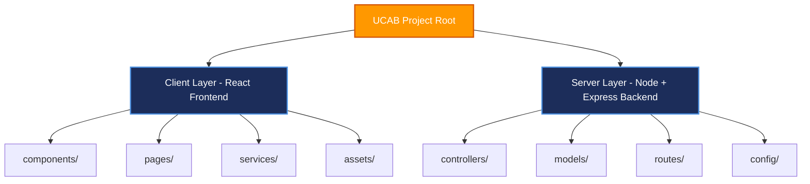

# CREATING PROJECT FOLDER

## Project Name

**UCAB – Cab Booking System**

## Technology Stack

MERN Stack (MongoDB, Express.js, React.js, Node.js)

---

# Objective

The project folder configuration establishes the physical workspaces for the client and server applications. Decoupling the client-side UI files from server-side services prevents file structure clutter, allows for independent configuration setups, and ensures clean environment mappings.

---

# Development Workspace Layout

### Step 1: Create Main Project Folder
Create the main container folder that holds both local modules of the MERN application:
```text
UCAB
```

---

### Step 2: Create Client Folder (React.js Frontend)
Within the `UCAB` root directory, instantiate a folder for the React.js client interface code:
```text
Client
```

#### Purpose & Key Subdirectories:
* **UI Pages & Components**: Views (e.g., Login, Admin Dashboard, Rider Dashboard) and reusable interface pieces (e.g., Buttons, Custom Maps).
* **API Services**: Global endpoints queries (Axios interceptor files).
* **Assets**: Raw UI resource components (icons, logos, fonts).

---

### Step 3: Create Server Folder (Node.js Backend)
Within the `UCAB` root directory, create a folder for the backend REST API engine:
```text
Server
```

#### Purpose & Key Subdirectories:
* **Models**: Mongoose database schemas defining database validation constraints.
* **Controllers**: Request logic engines parsing payloads and calling models.
* **Routes**: Express endpoints exposing specific controllers to frontend requests.
* **Config**: Database driver mappings (MongoDB connection setups).

---

### Step 4: Visual Studio Code Integration
Open Visual Studio Code, navigate to the main container workspace:
* **File** → **Open Folder** → **UCAB**

The active directory tree displays as follows:
```text
UCAB/
│
├── Client/       # React.js UI codebase
└── Server/       # Express.js REST API service codebase
```

---

# Workspace Structure Diagram

Below is the directory mapping representation outlining the structural division of code assets:



---

# Strategic Benefits

* **Clean Separation of Concerns**: Decouples client dependencies (`package.json` in Client) from server libraries (`package.json` in Server).
* **Targeted Deployment Scaling**: Frontend assets can be shipped directly to static CDNs (Vercel/Netlify) while server processes are hosted on elastic nodes (Render/AWS).
* **Conflict Resolution**: Team members working on Express APIs do not interfere with React layout changes.

---

# Expected Outcome

Successfully created the initial folder structure for the UCAB Cab Booking System with separate Client and Server directories, preparing the project for MERN Stack development.
