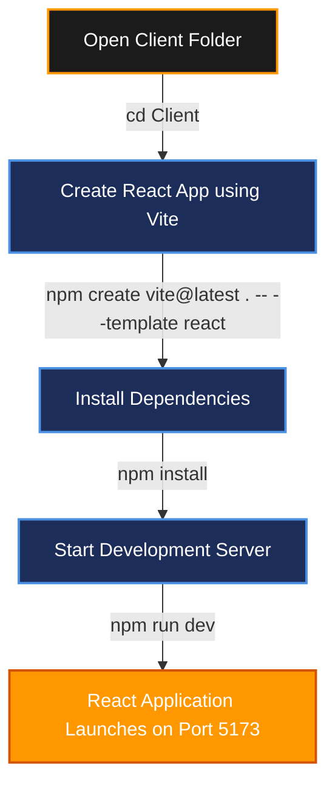

# CLIENT SETUP (INSTALLING REACT APP)

## Project Name

**UCAB – Cab Booking System**

## Technology Stack

React.js, Vite, JavaScript

---

# Objective

The objective of this task is to configure and initialize the React.js frontend workspace using Vite. React provides a robust component-based architecture for crafting reactive user interfaces, while Vite yields extremely fast server spin-ups and Hot Module Replacement (HMR) capabilities during development.

---

# Software Requirements

* **Node.js**: version `16.0.0` or higher.
* **npm**: version `8.0.0` or higher.
* **IDE**: Visual Studio Code (or equivalent).
* **Web Browser**: Chrome, Firefox, Safari, or Edge.

---

# Setup Instructions

### Step 1: Open Client Folder
Open a system terminal in your project directory and step into the React client container:
```bash
cd Client
```

---

### Step 2: Create React Application Using Vite
Initialize a React JS boilerplate configuration by executing:
```bash
npm create vite@latest . -- --template react
```

#### Selection Parameters:
* **Framework**: React
* **Variant**: JavaScript

---

### Step 3: Install Core Dependencies
Download local package nodes defined in `package.json`:
```bash
npm install
```

This resolves the dependency tree and generates the local `node_modules` file directory.

---

### Step 4: Run the Development Server
Launch the local Hot Module Reloading server:
```bash
npm run dev
```

The terminal logs the local development gateway URL:
```text
  VITE v5.x.x  ready in X ms

  ➜  Local:   http://localhost:5173/
  ➜  Network: use --host to expose
```

Open your browser and navigate to `http://localhost:5173/` to view the running React application.

---

# Project Structure After Setup

Following completion of the setup, the `Client` directory layout will appear as:

```text
Client/
│
├── node_modules/       # Local dependency packages
├── public/             # Static public assets
├── src/                # Core React source codebase
│   ├── assets/         # CSS styles and image assets
│   ├── App.jsx         # Root layout container
│   └── main.jsx        # App bundle mount hook entry-point
│
├── package.json        # Manifest file mapping dependencies
├── vite.config.js      # Custom Vite compiler settings
└── index.html          # Main HTML frame entry-point
```

---

# Setup Workflow

Below is the installation process flow:



---

# Strategic Advantages of React with Vite

* **Hot Module Replacement (HMR)**: Live code changes render instantly on screen without complete page resets.
* **Component-Based UI**: Code modularity using reusable UI components (e.g. BookingForm, Sidebar, CabCard).
* **Speedy Builds**: Vite utilizes native ES modules to compile code files dynamically.

---

# Expected Output

After successful setup:
1. The React app bundle folder structure is initialized.
2. All packages map successfully inside `node_modules`.
3. The development compilation runs without compiler errors.
4. The React template page loads successfully at `http://localhost:5173/`.
