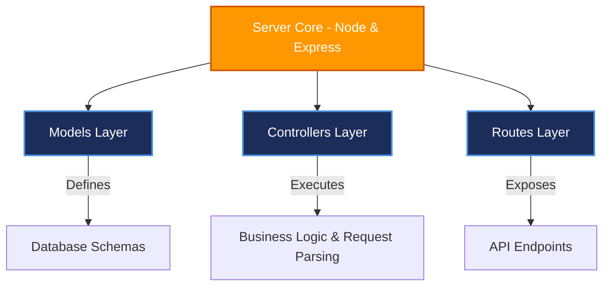

# SERVER SETUP (npm init)

## Project Name

**UCAB – Cab Booking System**

## Technology Stack

Node.js, Express.js, MongoDB

---

# Objective

The objective of this task is to initialize the Node.js backend environment for the UCAB Cab Booking System. This setup provides the foundation for creating Express APIs, executing server-side business logic, configuring middlewares, and managing the database interface.

---

# Software Requirements

* **Node.js**: version `16.0.0` or higher.
* **npm**: version `8.0.0` or higher.
* **IDE**: Visual Studio Code (or equivalent).

---

# Setup Instructions

### Step 1: Open Server Folder
Open your terminal in Visual Studio Code and navigate to the backend Server folder:
```bash
cd Server
```

---

### Step 2: Initialize Node.js Project
Run the npm initialization command to instantiate the local package manifests:
```bash
npm init -y
```

This command generates a default **package.json** file mapping project metadata and run scripts:
```json
{
  "name": "server",
  "version": "1.0.0",
  "main": "server.js",
  "scripts": {
    "start": "node server.js"
  },
  "license": "ISC"
}
```

---

### Step 3: Create Main Server File
Create the primary backend entry-point file:
```text
server.js
```

#### Core Server Code Example:
```javascript
const express = require("express");
const app = express();

// Parsing middleware
app.use(express.json());

// Server listener
const PORT = 5000;
app.listen(PORT, () => {
    console.log(`Server Running on Port ${PORT}`);
});
```

---

### Step 4: Create Project Subfolders
Create the core directories required to enforce the MVC architecture pattern inside the `Server` root:

#### 1. Models Folder (`models`)
* **Purpose**: Houses Mongoose models and database schemas.
* *Examples*: `UserModel.js`, `DriverModel.js`, `RideModel.js`.

#### 2. Controllers Folder (`controllers`)
* **Purpose**: Encapsulates business logic, database queries, and response formatting.
* *Examples*: `UserController.js`, `DriverController.js`, `RideController.js`.

#### 3. Routes Folder (`routes`)
* **Purpose**: Maps API endpoints to their corresponding controller handler functions.
* *Examples*: `userRoutes.js`, `driverRoutes.js`, `rideRoutes.js`.

---

# Folder Structure

Following setup, the backend directory maps as follows:

```text
Server/
│
├── package.json        # Project metadata and dependencies
├── server.js           # Server startup and middleware mounting file
│
├── models/             # Database schemas
├── controllers/        # Request handling and logic code
└── routes/             # Network API endpoint maps
```

---

# Server Architecture Mapping

Below is the conceptual structure showing how the backend separates its layers:



---

# Advantages of Modular Backend Structure

* **Organized codebase**: Clear segregation of router maps, database fields, and control algorithms.
* **Scalable architecture**: Quick addition of new features (e.g. coupon routing or messaging models) without breaking current controllers.
* **Separation of Concerns**: Simplifies debugging (e.g. database schema changes are made inside models, query logic changes inside controllers).

---

# Expected Output

After completing this task:
1. `package.json` file is successfully generated.
2. `server.js` startup file is configured.
3. The `models`, `controllers`, and `routes` directories are created.
4. Backend template structure is prepared for active database integration.
