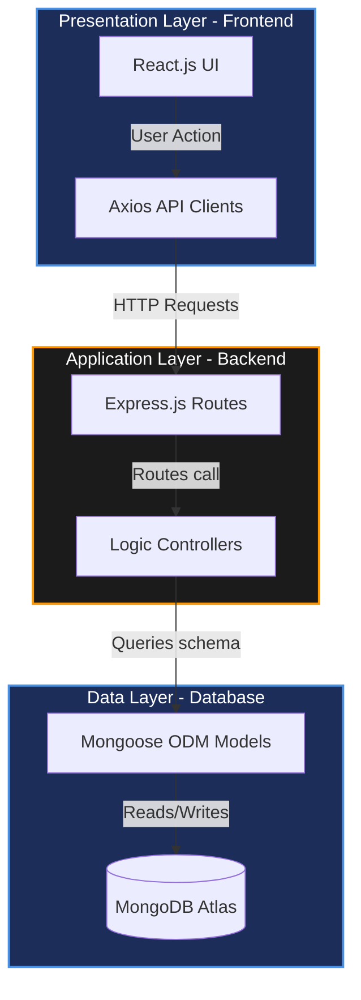

# PROJECT ARCHITECTURE

## Project Name

**UCAB – Cab Booking System**

## Objective

Project Architecture defines the overall structure of the UCAB Cab Booking System, including its components, technologies, data flow, and interactions between the frontend, backend, and database layers. The architecture ensures scalability, maintainability, security, and efficient communication among all modules.

---

# Architecture Overview

The UCAB application follows a standard **Three-Tier Architecture** pattern, splitting responsibility across the client UI, the middleware logic server, and the database persistence layers.



---

## 1. Presentation Layer (Frontend)
Developed using React.js, this tier handles everything the client interacts with directly in their web browser.
* **UI views**: Render user dashboard widgets, map tracking, and payment gateways.
* **Component state structures**: Enforce data validations inside input forms (e.g. pickup checks).
* **API Calls**: Send and receive JSON payloads over the network using `Axios`.

---

## 2. Application Layer (Backend)
Developed using Node.js and Express.js, this middleware tier handles business logic, security constraints, and API dispatch operations.
* **Authentication**: Signs and decrypts stateless token payloads (JWT).
* **Driver Allocator**: Searches and flags available drivers based on proximity radius.
* **Status Updates**: Pushes booking state updates to clients over HTTP or WebSocket channels.

---

## 3. Data Layer (Database)
Developed using MongoDB and Mongoose ODM, this tier handles raw document storage and transaction logging.
* **Mongoose ODM**: Maps collection structures and checks data formats.
* **Indexes**: Sets geospatial coordinates indexes for fast nearby searches.
* **Collections**: Holds persisted data nodes for `Users`, `Drivers`, `Rides`, and `Payments`.

---

# Technologies Used

* **Frontend**: React.js, JavaScript, Bootstrap CSS, Axios.
* **Backend**: Node.js, Express.js, JWT Authentication, bcryptjs.
* **Database**: MongoDB, Mongoose ODM.
* **Development Tools**: Visual Studio Code, Git/GitHub, Postman API client.

---

# Project Modules

### User Module
Handles account creations, logins, and settings configuration.
* *Features*: Rider Registration, JWT Logins, profile updates, booking logs view.

### Driver Module
Coordinates driver onboarding, location updates, and trip states.
* *Features*: Driver signup, availability online status toggles, accepting/rejecting ride allocations.

### Ride Management Module
Core routing engine calculating fares and tracking trips.
* *Features*: Cab tier choices, dynamic fare estimators, real-time map pings, cancellations.

### Payment Module
Invoicing and transaction confirmation systems.
* *Features*: Stripe/Razorpay checkout gateways, transaction entries generation, receipt PDF downloads.

### Admin Module
Global system monitoring and configuration panels.
* *Features*: Driver validation logs, user suspension filters, revenue reports dashboard.

---

# Data Flow Example

Below is the execution pipeline for a standard database query:

```text
User Action (React)
    ▼
Axios HTTP Request
    ▼
Express Route Listener
    ▼
Business Logic (Controller)
    ▼
Schema Query (Mongoose Model)
    ▼
Database Read/Write (MongoDB)
    ▼
Controller response output (JSON)
    ▼
React state update (Renders UI)
```

---

# Architecture Benefits

* **Scalability**: Decoupling frontend components from database schemas allows scaling each layer independently.
* **High Security**: Enforces hashing algorithms (bcrypt) on user credentials and verifies JWT signatures on API routes.
* **Maintainability**: Clear separation of controllers, routes, and models ensures clean code organization.
* **High Performance**: Optimizes read/write latency using Mongoose pre-indexes and geospatial queries.

---

# Expected Outcome

Successfully designed a scalable MERN Stack architecture for the UCAB Cab Booking System. The architecture enables secure authentication, ride booking, payment processing, and efficient communication between all application layers.
