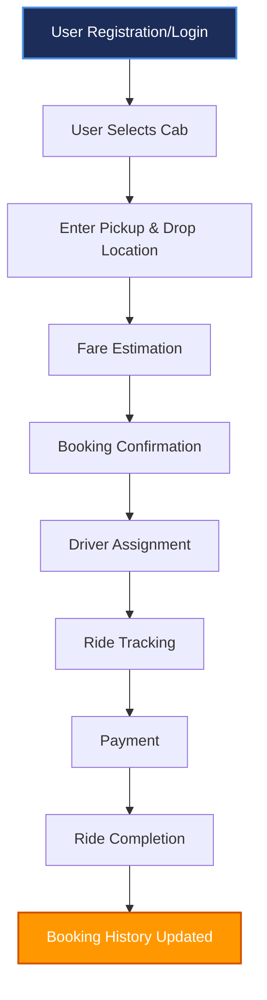

# 🚖 UCAB – MERN Stack Cab Booking System

UCAB is a full-stack Cab Booking Web Application developed using the **MERN Stack (MongoDB, Express.js, React.js, and Node.js)**. The application provides a seamless platform for users to book cabs, track rides, manage bookings, and make secure payments. It also includes an Admin panel for managing users, cabs, and bookings.

---

# 📌 Project Overview

UCAB simplifies daily transportation by allowing users to book rides online with an intuitive interface. The system provides role-based authentication for Users and Admins, secure booking management, real-time ride tracking, and payment support.

---

# 🚀 Features

### 👤 User Module
- User Registration & Login
- Secure JWT Authentication
- Browse Available Cabs
- Book a Cab
- Schedule Future Rides
- Ride Cancellation
- View Booking History
- Download Booking Receipt
- Real-Time Ride Tracking

### 🚗 Driver Module
- Driver Login
- View Assigned Rides
- Accept / Reject Booking Requests
- Update Ride Status
- View Ride History
- Earnings Dashboard

### 👨💼 Admin Module
- Admin Authentication
- Dashboard Overview
- Manage Users
- Manage Drivers
- Manage Cabs
- Manage Bookings
- Monitor Payments
- View Reports & Analytics

---

# 🛠 Technology Stack

## Frontend
* React.js
* React Router DOM
* Bootstrap
* Axios
* HTML5
* CSS3
* JavaScript (ES6)

## Backend
* Node.js
* Express.js
* JWT Authentication
* bcryptjs
* Multer
* CORS

## Database
* MongoDB
* Mongoose ODM

## Development Tools
* Visual Studio Code
* Git
* GitHub
* Postman
* MongoDB Compass
* Node.js
* npm

---

# 📂 Project Structure

```text
UCAB/
│
├── client/                     # React Frontend
│   ├── public/                 # Static public files
│   ├── src/                    # App source code
│   │   ├── Components/         # Reusable UI widgets
│   │   ├── Pages/              # Page layouts
│   │   ├── Assets/             # Images & backgrounds
│   │   ├── App.jsx             # Main routing layout
│   │   └── main.jsx            # React mounting hook
│   └── package.json            # Front-end dependencies
│
└── server/                     # Node.js/Express Backend
    ├── controllers/            # Request handlers (MVC)
    ├── db/                     # DB connection config
    ├── middlewares/            # Auth & Multer interceptors
    ├── models/                 # Database schemas
    ├── routes/                 # API endpoint routers
    ├── uploads/                # Static uploaded images
    ├── server.js               # Entry script startup
    └── package.json            # Back-end dependencies
```

---

# 🗄 Database Collections

* Users
* Admins
* Drivers
* Cars
* Bookings
* Payments

---

# 🔄 System Workflow

Below is the step-by-step trip lifecycle for a standard booking:



---

# 🔐 Authentication

* JWT Token Authentication
* Password Encryption using `bcryptjs`
* Protected Router Guards
* Role-Based Access Control (RBAC)

---

# 📡 REST API Endpoints

### User APIs
* `POST /api/users/register` - Registers a new rider account.
* `POST /api/users/login` - Authenticates user credentials & returns token.
* `GET /api/users/profile` - Fetches the authenticated user profile card.

### Admin APIs
* `POST /api/admin/login` - Authenticates administrator credentials.
* `GET /api/admin/users` - Fetches the list of all registered riders.

### Cars APIs
* `GET /api/cars` - Lists all available cab categories.
* `POST /api/cars` - Registers a new vehicle entry into the system.
* `PUT /api/cars/:id` - Updates vehicle records by ID.
* `DELETE /api/cars/:id` - Deletes a vehicle entry from database records.

### Bookings APIs
* `POST /api/bookings` - Submits a new ride booking request.
* `GET /api/bookings` - Fetches list of active and historical bookings.
* `PUT /api/bookings/:id` - Updates booking parameters (e.g. status changes).
* `DELETE /api/bookings/:id` - Cancels booking request if allowed.

---

# ⚙ Installation

### Clone Repository
```bash
git clone https://github.com/yourusername/UCAB.git
cd UCAB
```

### Client Setup
```bash
cd client
npm install
npm run dev
```
*Frontend runs locally on: `http://localhost:5173`*

### Server Setup
```bash
cd ../server
npm install
nodemon server.js
```
*Backend runs locally on: `http://localhost:8000`*

### Environment Variables
Create a `.env` file inside the **server** directory.
```env
PORT=8000
MONGO_URI=mongodb://localhost:27017/UCAB
JWT_SECRET=your_secret_key
```

---

# 💻 Software Requirements

* Windows 10/11
* Node.js v16+
* npm v8+
* MongoDB
* VS Code
* Git
* Postman
* Google Chrome

---

# 🖥 Hardware Requirements

* Intel Core i5 / Ryzen 5
* 8 GB RAM (16 GB Recommended)
* 1 GB Free Storage
* 1366×768 Display

---

# 📷 Project Demonstration

The repository includes:
* [Architecture Diagram](file:///C:/Users/ADMIN/.gemini/antigravity/scratch/Cab-Booking-Project/3.Project%20Design%20Phase/project_architecture.md)
* [ER Diagram](file:///C:/Users/ADMIN/.gemini/antigravity/scratch/Cab-Booking-Project/3.Project%20Design%20Phase/er_diagram.md)
* [User Flow](file:///C:/Users/ADMIN/.gemini/antigravity/scratch/Cab-Booking-Project/2.Requirement%20Analysis/user_flow.md)
* [MVC Pattern](file:///C:/Users/ADMIN/.gemini/antigravity/scratch/Cab-Booking-Project/3.Project%20Design%20Phase/mvc_pattern.md)
* [Backend Structure](file:///C:/Users/ADMIN/.gemini/antigravity/scratch/Cab-Booking-Project/5.Project%20Development%20Phase/backend_structure.md)
* [Frontend Structure](file:///C:/Users/ADMIN/.gemini/antigravity/scratch/Cab-Booking-Project/5.Project%20Development%20Phase/frontend_structure.md)
* [MongoDB Configuration](file:///C:/Users/ADMIN/.gemini/antigravity/scratch/Cab-Booking-Project/5.Project%20Development%20Phase/configure_mongodb.md)
* Demo Screenshots
* Demo Video

---

# 🎯 Learning Outcomes

* MERN Stack Development
* REST API Development
* MongoDB Database Design
* React Component Development
* JWT Authentication
* CRUD Operations
* MVC Architecture
* Git & GitHub Version Control
* Full Stack Application Deployment

---

# 📌 Future Enhancements

* Live GPS Tracking
* Google Maps API Integration
* Razorpay Payment Gateway
* Email Notifications
* Push Notifications
* Driver Rating System
* Ride Sharing
* Coupon Management
* Admin Analytics Dashboard

---

# 👨💻 Developed By

Mokhamatam Niharika
Naru Tejasri
Samarouthu Bala Gangadhara Sai Ram
Seshadri Naidu Bantrothu

Kolakaluri Vijay Babu
B.Tech (3rd Year)  
MERN Stack Development Project  
SmartBridge × SkillWallet  

---

# 📄 License

This project is developed for educational purposes as part of the SmartBridge SkillWallet MERN Stack Program.

---

## ⭐ If you like this project, don't forget to Star this repository!
